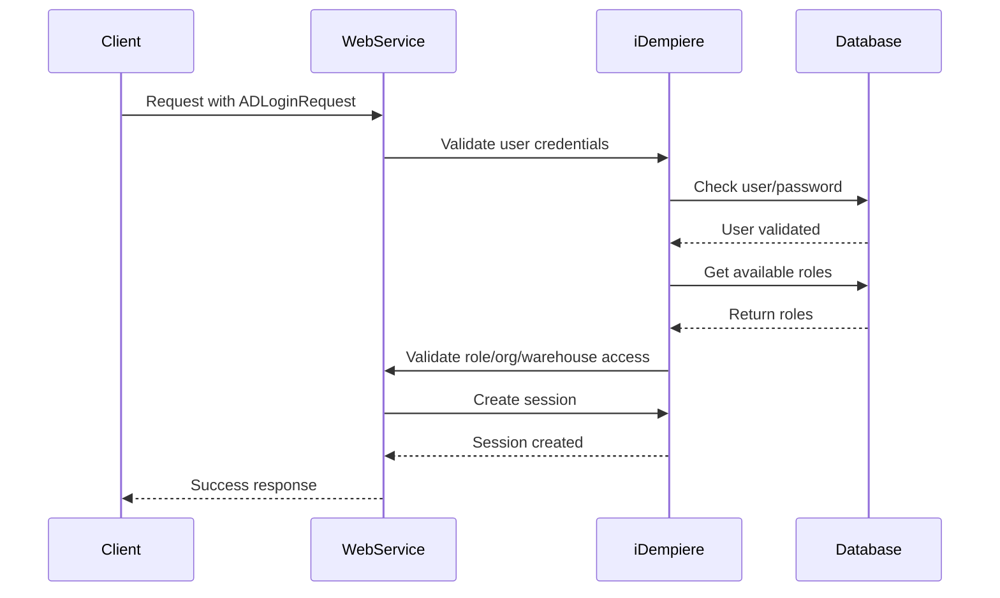

All iDempiere web service requests require authentication using the ADLoginRequest structure. The system validates credentials, role access, and establishes a session context for subsequent operations.

## Authentication Flow



## Login Request Structure

Every web service request includes an ADLoginRequest element containing authentication and context information.

### ADLoginRequest Parameters

<ParamField path="user" type="string" required>
  Username or email address. The system configuration determines whether to use username or email for login (controlled by `USE_EMAIL_FOR_LOGIN` system configuration).
  
  ```
  WebService
  admin@idempiere.com (if email login enabled)
  ```
</ParamField>

<ParamField path="pass" type="string" required>
  User password in plain text. The password is validated against the AD_User table.
  
  <Warning>
    Always use HTTPS/TLS to encrypt credentials in transit.
  </Warning>
</ParamField>

<ParamField path="lang" type="string" required>
  Language and locale code for the session. Affects date formats, decimal separators, and translated messages.
  
  Common values:
  - `en_US` - English (United States)
  - `es_MX` - Spanish (Mexico)
  - `de_DE` - German (Germany)
  - `fr_FR` - French (France)
  - `zh_CN` - Chinese (China)
</ParamField>

<ParamField path="ClientID" type="integer" required>
  The tenant/client ID (AD_Client_ID). System client is 0, but web services typically use a specific tenant.
  
  The user must have access to this client.
</ParamField>

<ParamField path="RoleID" type="integer" required>
  The role ID (AD_Role_ID) to use for this session. The role must:
  - Be assigned to the user
  - Have RoleType of NULL or 'WS' (web service enabled)
  - Have access to the specified organization
  - Have access to the requested web service type
</ParamField>

<ParamField path="OrgID" type="integer" required>
  The organization ID (AD_Org_ID) for the session context. The role must have access to this organization through:
  - `IsAccessAllOrgs = 'Y'`, or
  - AD_Role_OrgAccess entries, or
  - AD_User_OrgAccess entries (if `IsUseUserOrgAccess = 'Y'`)
</ParamField>

<ParamField path="WarehouseID" type="integer" required>
  The warehouse ID (M_Warehouse_ID) for the session. Can be 0 if no warehouse is required. The warehouse must belong to an organization accessible by the role.
</ParamField>

<ParamField path="stage" type="integer" required>
  Session expiry time in minutes. Common values:
  - `9` - Standard session (recommended)
  - `0` - Session expires immediately after request (not cached)
  - `60` - 1 hour session
  - `480` - 8 hour session
  
  Sessions are cached based on: ClientID, OrgID, Username, RoleID, WarehouseID, Language, Password, and IP Address.
</ParamField>

## Authentication Examples

<CodeGroup>
```json REST/JSON
{
  "ADLoginRequest": {
    "user": "WebService",
    "pass": "WebService",
    "lang": "en_US",
    "ClientID": 11,
    "RoleID": 50004,
    "OrgID": 11,
    "WarehouseID": 103,
    "stage": 9
  }
}
```

```xml SOAP/XML
<ADLoginRequest>
  <user>WebService</user>
  <pass>WebService</pass>
  <lang>en_US</lang>
  <ClientID>11</ClientID>
  <RoleID>50004</RoleID>
  <OrgID>11</OrgID>
  <WarehouseID>103</WarehouseID>
  <stage>9</stage>
</ADLoginRequest>
```

```bash cURL
curl -X POST https://localhost:8443/ADInterface/services/rest/model_adservice/query_data \
  -H "Content-Type: application/json" \
  -H "Accept: application/json" \
  -d '{
    "ModelCRUDRequest": {
      "ModelCRUD": {
        "serviceType": "QueryBPartner",
        "TableName": "C_BPartner",
        "RecordID": 0,
        "Filter": "",
        "Action": "Read"
      },
      "ADLoginRequest": {
        "user": "WebService",
        "pass": "WebService",
        "lang": "en_US",
        "ClientID": 11,
        "RoleID": 50004,
        "OrgID": 11,
        "WarehouseID": 103,
        "stage": 9
      }
    }
  }'
```
</CodeGroup>

## Session Management

### Session Caching

iDempiere caches authenticated sessions to improve performance and reduce database load. Sessions are cached using a composite key:

```java
String key = ClientID + "|" + OrgID + "|" + Username + "|" + 
             RoleID + "|" + WarehouseID + "|" + Language + "|" + 
             Password + "|" + IPAddress;
```

<Info>
  If any parameter changes (including IP address), a new session is created. This ensures security while allowing session reuse for repeated requests.
</Info>

### Session Expiry

Sessions expire based on the `stage` parameter (expiry time in minutes):

- **Active Sessions**: Refreshed on each successful authorization
- **Expired Sessions**: Automatically removed when `connectCount == 0` and expiry time elapsed
- **Session Cleanup**: Sessions are logged out and removed from cache when expired

### Context Variables

Authenticated sessions establish the following context variables:

<ResponseField name="#AD_Client_ID" type="integer">
  Current client/tenant ID
</ResponseField>

<ResponseField name="#AD_Org_ID" type="integer">
  Current organization ID
</ResponseField>

<ResponseField name="#AD_User_ID" type="integer">
  Current user ID
</ResponseField>

<ResponseField name="#AD_User_Name" type="string">
  Current user name
</ResponseField>

<ResponseField name="#AD_Role_ID" type="integer">
  Current role ID
</ResponseField>

<ResponseField name="#M_Warehouse_ID" type="integer">
  Current warehouse ID
</ResponseField>

<ResponseField name="#SalesRep_ID" type="integer">
  Sales representative ID (same as user ID)
</ResponseField>

<ResponseField name="#AD_Language" type="string">
  Session language code
</ResponseField>

<ResponseField name="#Date" type="timestamp">
  Current date for the session
</ResponseField>

## Role Configuration

### Web Service Enabled Roles

For a role to access web services, it must meet these requirements:

1. **Role Type**: Must be NULL or 'WS' in the AD_Role table
2. **Active**: Role must be active
3. **User Assignment**: Role must be assigned to the user
4. **Organization Access**: Role must have access to the specified organization

### Web Service Type Access

Access to specific web service operations is controlled through `WS_WebServiceTypeAccess`:

```sql
SELECT IsActive 
FROM WS_WebServiceTypeAccess 
WHERE AD_Role_ID IN (
  SELECT AD_Role_ID FROM AD_Role WHERE AD_Role_ID = ?
  UNION 
  SELECT Included_Role_ID FROM AD_Role_Included WHERE AD_Role_ID = ?
) 
AND WS_WebServiceType_ID = ?
```

The query checks:
- Direct role access
- Included role access (role inheritance)
- Active status of the access record

## Validation Hooks

iDempiere provides extension points for custom authentication logic through the `IWSValidator` interface.

### Validation Timing

<Steps>
  <Step title="Before Login">
    `TIMING_BEFORE_LOGIN` - Validate credentials before authentication
    
    Use cases:
    - IP whitelist validation
    - Rate limiting
    - Custom password policies
  </Step>
  
  <Step title="After Login">
    `TIMING_AFTER_LOGIN` - Validate after successful authentication
    
    Use cases:
    - Audit logging
    - External system integration
    - License validation
  </Step>
  
  <Step title="On Authorization">
    `TIMING_ON_AUTHORIZATION` - Validate service type access
    
    Use cases:
    - Service-specific authorization
    - Usage quota enforcement
    - Custom access control
  </Step>
</Steps>

### Custom Validator Example

```java
public class MyWSValidator implements IWSValidator {
  
  @Override
  public void login(ADLoginRequest loginRequest, Properties ctx, 
                    MWebServiceType webServiceType, int timing) 
                    throws IdempiereServiceFault {
    
    if (timing == TIMING_BEFORE_LOGIN) {
      // Validate IP address
      String ipAddress = ctx.getProperty("#IPAddress");
      if (!isAllowedIP(ipAddress)) {
        throw new IdempiereServiceFault(
          "Access denied from IP: " + ipAddress,
          new QName("IPValidation")
        );
      }
    }
    
    if (timing == TIMING_ON_AUTHORIZATION) {
      // Check usage quota
      if (isQuotaExceeded(webServiceType)) {
        throw new IdempiereServiceFault(
          "Usage quota exceeded for service type",
          new QName("QuotaValidation")
        );
      }
    }
  }
}
```

## Common Authentication Errors

<AccordionGroup>
  <Accordion title="Error: User invalid">
    **Cause**: Username/password combination is incorrect.
    
    **Solution**: 
    - Verify credentials in the AD_User table
    - Check if email login is enabled (USE_EMAIL_FOR_LOGIN)
    - Ensure user is active
  </Accordion>
  
  <Accordion title="Error: Tenant not allowed for this user">
    **Cause**: User doesn't have access to the specified ClientID.
    
    **Solution**:
    - Verify user has a role in the specified client
    - Check AD_User_Roles table
  </Accordion>
  
  <Accordion title="Error: Role not allowed for this user">
    **Cause**: Specified RoleID is not assigned to the user or not web service enabled.
    
    **Solution**:
    - Check AD_User_Roles for role assignment
    - Verify role has RoleType NULL or 'WS'
    - Ensure role is active
  </Accordion>
  
  <Accordion title="Error: Org not allowed for this role">
    **Cause**: Role doesn't have access to the specified OrgID.
    
    **Solution**:
    - Check AD_Role_OrgAccess table
    - Verify IsAccessAllOrgs setting on role
    - If using user org access, check AD_User_OrgAccess
  </Accordion>
  
  <Accordion title="Error: Warehouse not allowed for this org">
    **Cause**: Warehouse doesn't belong to an accessible organization.
    
    **Solution**:
    - Verify warehouse exists (M_Warehouse)
    - Check warehouse organization
    - Try WarehouseID = 0 if no warehouse needed
  </Accordion>
  
  <Accordion title="Error: Login role does not have access to the service type">
    **Cause**: Role lacks permission for the specific web service type.
    
    **Solution**:
    - Add entry in WS_WebServiceTypeAccess
    - Verify service type is active
    - Check included roles if using role inheritance
  </Accordion>
</AccordionGroup>

## Security Best Practices

<CardGroup cols={2}>
  <Card title="Use HTTPS" icon="lock">
    Always use TLS/SSL encryption for web service communications to protect credentials and data in transit.
  </Card>
  
  <Card title="Dedicated Service Users" icon="user-shield">
    Create dedicated user accounts for web service integration rather than using personal accounts.
  </Card>
  
  <Card title="Least Privilege Roles" icon="user-lock">
    Assign roles with minimal required permissions. Create specific web service roles with restricted access.
  </Card>
  
  <Card title="Session Expiry" icon="clock">
    Use appropriate session expiry times. Shorter times for sensitive operations, longer for batch processing.
  </Card>
  
  <Card title="IP Whitelisting" icon="shield-check">
    Implement IP-based access control using custom validators or network-level restrictions.
  </Card>
  
  <Card title="Audit Logging" icon="file-text">
    Implement custom validators to log all web service access for security auditing.
  </Card>
</CardGroup>

## Testing Authentication

Test your authentication configuration:

<Steps>
  <Step title="Verify User Access">
    Log in to iDempiere UI with the web service user credentials to ensure the account works.
  </Step>
  
  <Step title="Check Role Configuration">
    Navigate to Role window and verify:
    - Role Type is NULL or WS
    - User is assigned to the role
    - Organization access is configured
  </Step>
  
  <Step title="Configure Service Type Access">
    In Web Service Type Access window, create entries for:
    - Role ID
    - Web Service Type
    - IsActive = Y
  </Step>
  
  <Step title="Test with cURL">
    Use a simple REST API call to verify authentication works end-to-end.
  </Step>
</Steps>
